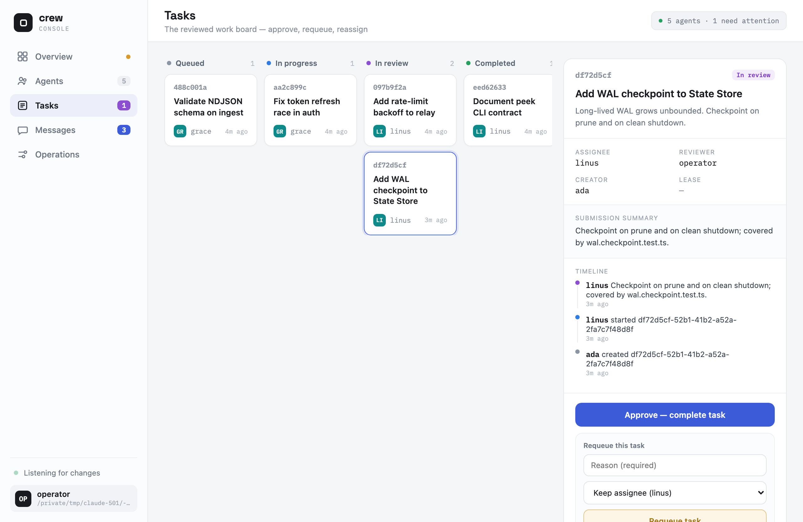

# crew examples

The [README Quickstart](./README.md#quickstart) covers the basic path: init, join, message,
one reviewed task. This document walks through six real, more involved scenarios that
together touch every command group in crew — launching a whole Team, a task getting rejected
and reassigned, wiring up several different agent CLIs, scripting crew into CI, cleaning up
an older or busier workspace, and watching and driving the whole Crew from a browser
Console. For the flag-by-flag reference behind every command here, see the
[CLI contract](./docs/design/cli-contract.md).

## 1. Launch a multi-agent team in tmux

```sh
crew init                                   # skip if this workspace is already initialized
crew teams                                  # dev: 1 manager, 2 workers, 1 inspector (packaged Team)
crew team dev --print                       # human summary of the plan; no side effects
crew team dev --launch --client claude-code --workers 3
```

- `crew teams` lists every `Team` document — both the ones packaged with crew and the ones
  saved in this project. The packaged `dev` Team ships with one manager, two workers, and
  one inspector.
- `--print` checks that the Team and Role documents are valid (a Role is the prompt that
  shapes an agent's behavior) and prints the exact tmux pane layout plus the `crew join`
  command for every pane. It writes no files, changes nothing in the State Store (the shared
  database file), starts no other program, and never calls tmux — so it is safe to re-run as
  often as you like while you edit a Team file.
- A live `--launch` first works out which coding CLI to run (`--client` wins, then a tracked
  `runtime.client` setting, then a default; if the Team mixes platform hints and neither is
  set, the command fails with a `USAGE` error). It then creates one tmux pane per Agent,
  waits for each Participant CLI (the AI coding tool in that pane) to start and register
  itself with crew, opens a
  `crew-relay` window unless you pass `--no-relay`, pastes the Task brief into the manager's
  pane, and connects your terminal to the session unless you pass `--no-attach`.
- `--workers 3` changes only how many Workers this run starts (any number from 1 to 32); the
  manager and inspector keep the counts the Team file declares.
- If a pane never becomes ready or never registers, crew tears down only the session *this*
  invocation created and reports `LAUNCH_FAILED` — it never leaves a half-built session
  behind. A session with the same derived name that is already running is left alone
  (`ALREADY_EXISTS`).
- Add `--worktree <branch>` to plan the whole Team against a dedicated git worktree — a
  separate working copy of the repository, on its own branch, so the Team's file changes
  stay out of your main checkout. A **live** launch with a worktree isn't supported yet and
  is refused with `USAGE` (re-run with `--no-worktree`, or use `--print`, which still shows
  the path the worktree would use).
- After you disconnect and end the tmux session, crew removes only the Agent rows this
  launch created that never did anything — no Task, no Message, no Task Event history. That
  frees their ids so `dev` can be launched again immediately. Any Agent that already did
  something stays active until you run `crew leave` for it or run `crew clean`.

## 2. A rejected task gets requeued and reassigned

```sh
crew join worker2 --role worker      # a second worker, on standby for exactly this kind of reassignment

crew task create manager worker --reviewer inspector \
  --title "Fix the flaky auth test" --body "Intermittently fails in CI"
crew task start worker <task-id>
crew task submit worker <task-id> --summary "Added a retry around the token refresh call"

# The inspector isn't satisfied with a retry that papers over the real bug.
crew task requeue inspector <task-id> --reason "Retry masks the race, doesn't fix it" --to worker2

crew task start worker2 <task-id>
crew task submit worker2 <task-id> --summary "Fixed the race by locking the token cache"
crew task approve inspector <task-id> --summary "Confirmed the race is gone"
crew task show <task-id> --events
```

- `create` puts the Task in `queued`. `start` grants a 15-minute Lease — a claim that
  expires on its own, so a crashed agent can't hold a Task forever — and moves it to
  `in_progress`. `submit` moves it to `submitted`.
- `requeue` always requires an actor and a `--reason`. The Task's creator or its reviewer
  can send any Submission (a worker's submitted result, waiting for review) back this way,
  and can also rescue a Task stuck `in_progress` —
  but only after its Lease has expired. `--to` hands the Task to a different Agent for the
  retry, as shown above.
- `worker2` repeats the same `start`/`submit` steps. `approve --summary` is optional, but
  when you supply it, it must not be empty.
- `task show <task-id> --events` reads the Task and its full Task Event history from a
  single database snapshot, so a status change happening at the same moment can't make the
  two disagree — you see the entire
  `submitted -> requeued -> in_progress -> submitted -> completed` trail with the actor
  behind each step.
- To scan open work instead of one Task: `crew task list --reviewer inspector --status submitted`
  shows everything waiting for this inspector's review; `crew task list --stale-lease` finds
  work whose 15-minute Lease expired without a submission.

## 3. Setting up four different agent CLIs in one workspace

```sh
crew setup --list                    # detect what's installed and its artifact drift; writes nothing
crew setup claude-code
crew setup codex-cli
crew setup gemini-cli
crew setup copilot-cli
crew setup ollama                    # a local model backend, not a Participant CLI
```

- Bare `setup --list` prints one `setup_target` line per target: whether its executable is
  on `PATH`, which version was detected, and the state of any integration file `crew setup`
  wrote earlier — `managed-current`, `managed-outdated`, `managed-edited`, or `unmanaged`.
  It writes nothing, so it is safe to run first.
- `setup <participant>` writes that platform's integration file — the file that tells the
  coding CLI how to work with crew — for your whole user account by default; add `--project`
  to write it into this Workspace instead. Replacing a file that was edited by hand or not
  written by crew needs `--force`, and the old file is backed up to `<name>.bak.<epoch>`
  first.
- `setup ollama` / `setup lmstudio` cover local model **backends** — servers that host a
  model on your own machine — not Participant CLIs. They write no file and only print a
  checked, fixed recipe of instructions (crew never talks to the backend itself);
  `--project`/`--force` are usage errors for a backend.

Now suppose the worker's terminal crashes mid-task. crew cannot detect a dead process on its
own — the Agent row stays `active` until someone archives it:

```sh
crew leave worker
# ...operator restarts the same coding CLI...
crew join worker --platform claude-code --resume
```

- `--resume` targets exactly the archived id and fails if that Agent is still active. If you
  leave out `--role`/`--platform`, whatever was stored before is kept — so `worker` keeps
  its full Message and Task history under the same id, instead of colliding with the old
  name and being registered as a new `worker-2`.

## 4. Scripting crew into CI with `--json`

```sh
#!/usr/bin/env bash
set -euo pipefail

# Fail the build if any task has been sitting past its 15-minute lease.
stale=$(crew task list --stale-lease --json | jq -s 'length')
if [ "$stale" -gt 0 ]; then
  echo "::error::$stale task(s) have an expired lease" >&2
  exit 1
fi

# A lightweight unread check for one agent's inbox, e.g. before waking a manager.
crew pending --agent manager --summary --json | jq '.unread_count'

# Environment/workspace health, without a Workspace present (e.g. a fresh CI runner).
crew doctor --system --json > doctor.ndjson || { echo "environment drift detected"; exit 1; }
```

- Every command that produces a list accepts `--json` and prints one complete JSON object
  per line (a format called NDJSON). An empty result prints nothing and still exits 0, so
  `jq` composes directly with no special case for "no results."
- `pending --summary` requires `--agent` and returns only `unread_count` and `max_unread_id`
  for the whole inbox — the smallest possible payload for a script that polls. It never
  marks the Messages it counts as read.
- `doctor --system` runs just the dependency checks (Node, the Participant CLIs, tmux, git,
  and the setup files written for your user account) and works without a `.crew/` Workspace
  present. It already exits 1 whenever a finding with `error` severity exists, so checking
  the exit code is usually enough; parse the `health_finding` records with `jq` only when
  you need to react to a specific `code` (for example `SETUP_DRIFT` or `DEPENDENCY_MISSING`).

## 5. Workspace hygiene at scale

```sh
crew doctor
```

Prints zero or more `health_finding` records (most noteworthy first) and one
`health_summary`. In an older or busier Workspace you will typically see findings such as
`STALE_LEASE` (a Task whose 15-minute Lease expired without a submission), `ARCHIVED_OWNER`
(a live Task whose creator, assignee, or reviewer has left), `SETUP_DRIFT` (a platform
integration file that was edited by hand or is out of date), and `NESTED_WORKSPACE` (another
`.crew/` in a parent or child directory — worth fixing before you run `prune`/`clean` from
the wrong place).

```sh
crew prune --messages-before 14d --tasks-before 30d
crew prune --vacuum
crew clean --force
```

- `prune` with these flags overrides the defaults (Messages older than 30 days, Tasks older
  than 90) for a Workspace that fills up faster than usual. A completed Task is kept
  regardless of age while any notification linked to it is still unread. `prune` always
  prints exactly one `prune_result`, even when nothing was deleted, so a script can read
  `messages_deleted`/`tasks_deleted` without special-casing "nothing to prune."
- `--vacuum` gives the freed disk space back to the operating system, but refuses
  (`ACTIVE_AGENTS`) while any Agent is still active — run it after everyone has left, for
  example as a weekly maintenance job.
- `clean --force` deletes only the State Store files (`crew.db`, `-wal`, `-shm`). Without
  `--force` it refuses in the same way while Agents are active, and it never touches the
  tracked `.crew/roles/`/`.crew/teams/` — a full reset of state that keeps your
  configuration.

## 6. Observe & drive a Crew from the browser Console

Once several Agents are working, watching them through separate terminal commands gets busy.
`crew ui` opens an optional local **Console** over the same Workspace — a browser dashboard
you can both read and act from:

```sh
crew ui                         # start the Console; prints an authenticated URL and opens a browser
crew ui --no-open               # start it but don't open a browser (copy the URL yourself)
crew ui --port 7420             # bind an exact port instead of a random free one
crew ui --json --no-open        # emit one ui_started record, then keep serving in the foreground
```


- `crew ui` starts an HTTP server that only you, the Operator, start; it stays in the
  foreground of your terminal and listens only on `127.0.0.1`, so it is reachable only from
  your own computer. Ctrl-C shuts it down; it never detaches or keeps running on its own,
  and every other crew command keeps working whether or not the Console is up. The files the
  browser needs are bundled into the package when it is built, so the Console works offline.
- Each run generates a **new secret token**, puts it into the URL it prints, and requires it
  on every request. Without `--port`, crew picks a random free port; an explicit
  `--port <n>` (1–65535) that is already taken fails rather than silently picking another.
- The dashboard is a **live, read-only** view of the agent roster, the `doctor` health
  checks, the task board (`queued -> in_progress -> submitted -> completed`, plus
  `abandoned`), each Task's detail and full event timeline, and recent Messages. These reads
  use unread-count summaries, history, and Task reads — they **never** call `receive`, so
  nothing on screen marks an Agent's Messages as read. Updates are pushed to the browser
  over one open connection (server-sent events), fed by a single poll on the server — each
  browser tab does not poll on its own.
- The human is the ordinary `operator` Agent (a normal Agent row, no special identity), so
  the Console can also **drive** the Crew through the same authority rules and Store
  operations as the CLI: send a Message, create a Task with any reviewer, approve or requeue
  a Submission you review, launch a Team without attaching a terminal, stop a Team that crew
  can prove it started, peek at a pane's text (cleaned of terminal control characters), and
  run `prune`/`clean`. The server always decides who is acting from the session itself — a
  request body cannot name a different actor.
- The three destructive actions — **Team stop, `prune`, and `clean`** — each require you to
  type a confirmation phrase in the browser before the request is sent:



- With `--json`, a successful start prints exactly one `ui_started` record (`url`, `port`,
  `workspace`) once the server is listening, then keeps serving; running `clean` from the
  Console ends the `crew ui` process after its response has been sent. Launching a Team from
  the Console never connects your terminal to the tmux session — **attaching to that session
  stays a deliberate terminal action** (`tmux attach`), never something the browser does for
  you.
- **Treat the printed URL as a secret.** Anyone on the same machine who obtains it can act
  as the Operator until the server stops, and it can linger in browser history and terminal
  scrollback. Don't paste or share it; restarting `crew ui` generates a new token, which
  makes the old URL useless.
