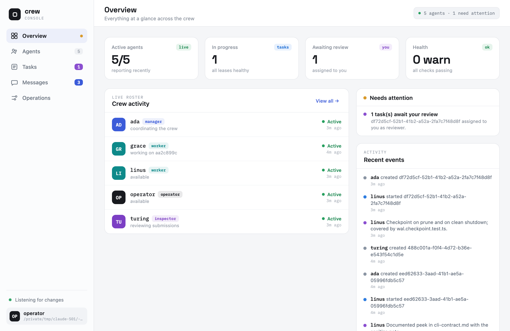
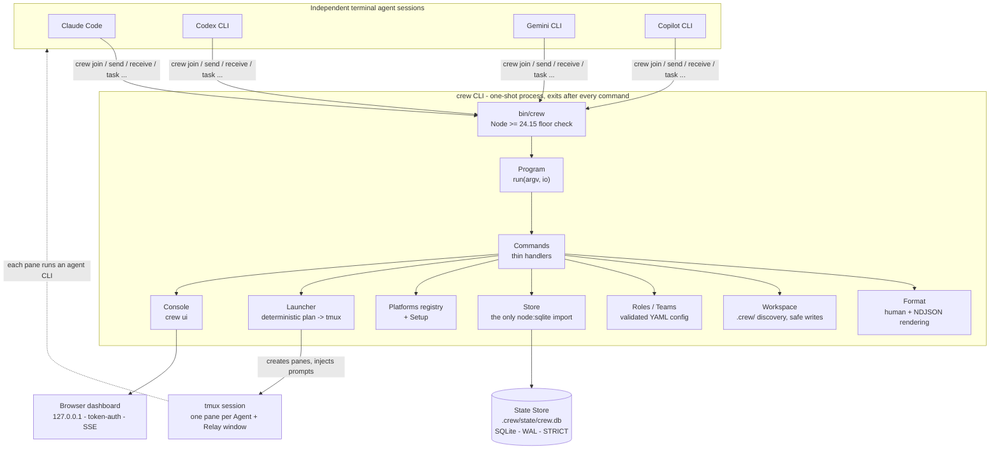

# crew

[](https://github.com/dichovsky/crew/actions/workflows/ci.yml)
[](./LICENSE)
[](https://nodejs.org)

crew is a command-line tool that coordinates AI coding assistants running in a terminal.
Tools such as Claude Code, Codex CLI, Gemini CLI, and GitHub Copilot CLI each run as their
own independent terminal session; crew gives those sessions a shared inbox for notes, a task
workflow where finished work must pass a separate review, and an optional launcher that opens
all of them side by side. crew never contacts an AI model provider itself — it only passes
coordination data between the sessions.

## Why crew

- **Nothing keeps running in the background, and there is no account or cloud service.**
  Every command reads or updates one small database file inside your project and then exits.
  No background process is needed just to pass a message between two agent sessions.
- **A task isn't done because the agent says so.** The Worker (the agent assigned the work)
  finishing and the reviewer accepting the result are two separate, enforced steps
  (`submitted` then `completed`), so a Worker can't mark its own work accepted.
- **Not locked to one vendor.** Claude Code, Codex CLI, Gemini CLI, Copilot CLI, and locally
  hosted models can all join the same Crew — the group of agents sharing one project's
  state. crew coordinates them; it doesn't replace them.
- **Both a human and a script can drive it.** Every command has a plain-text form for
  reading and a `--json` form that prints one complete JSON object per line for scripts to
  parse — there is no separate API to learn.
- **The tmux launcher is optional, not required.** tmux is a program that splits one
  terminal window into several live panes. You can register agents by hand in any ordinary
  terminal; add `crew team <name> --launch` only when you want crew to open and wire up a
  pane for each agent.
- **An optional browser Console for the whole Crew.** `crew ui` starts a local dashboard,
  reachable only from your own computer, where you can watch every Agent (every registered
  session) and run the routine actions you, the human Operator, would otherwise type as
  commands — all from one screen. You start it explicitly, it never turns into a background
  process, and no other feature needs it.

## Install

crew requires **Node.js `>=24.15`**. Its State Store — the single database file where crew
keeps all shared state — uses the built-in `node:sqlite` module, which only ships with
Node 24 and later.

`0.1.0` is published to npm. Install it globally:

```sh
npm install -g @dichovsky/crew
crew --version
```

Or build from source:

```sh
git clone https://github.com/dichovsky/crew.git
cd crew
npm install
npm run build      # compiles TypeScript + the Console assets into dist/
npm link           # puts the `crew` executable on your PATH
crew --version
```

The package name is **`@dichovsky/crew`**, but the
installed executable is **`crew`** (the plain `crew` name was already taken on npm - see
[DEC-7](./docs/design/decisions.md)). There is no background process, no local server, and no
cloud account: every `crew` command reads or updates the database file inside your project
and exits.

## Quickstart

Starting from an empty repository, this creates a Crew, registers two agents, sends a
message between them, and runs one reviewed task from start to finish (under ten minutes):

```sh
crew init                                             # writes .crew/ (tracked config, ignored state)

# Register a manager and a worker (their Participant CLI is optional metadata).
crew join manager --role manager --platform codex-cli
crew join worker  --role worker  --platform codex-cli
crew agents                                           # see the roster

# Direct messaging (no coupling between the two CLIs).
crew send manager worker "Inspect the auth module"
crew receive worker                                   # bounded, at-most-once

# A reviewed task: the worker submits, an inspector accepts - the two are never conflated.
crew join inspector --role inspector
crew task create manager worker --reviewer inspector --title "Fix the auth bug"
crew task start worker <task-id>                      # claims a 15-minute lease
crew task submit worker <task-id> --summary "patched the token refresh path"
crew task approve inspector <task-id>                 # only a Review completes a Task
crew task list
```

## Launching a team

Beyond one-off messages, crew can start a whole Team of agents at once, each in its own tmux
pane:

```sh
crew team dev --print                                  # preview the deterministic launch plan, no side effects
crew team dev --launch --client claude-code --workers 3
```

`dev` is the Team that ships with crew (a manager, some workers, one inspector). `--print`
shows exactly what a live launch would do — the tmux pane layout and the `crew join` command
for every pane — without doing any of it, and the same input always prints exactly the same
plan. `--launch` builds the real session: one Participant CLI (one AI coding tool) per pane,
plus a Relay window. The Relay notices when an idle pane's Agent has unread Messages and
gives that pane a nudge to check its Inbox — it never reads the Messages themselves. Every
agent is registered and ready before your terminal is connected to the session. `--workers 3`
starts three Workers for this run instead of the number the Team file declares.

This is one of six real, complicated scenarios written up in full in
[EXAMPLES.md](./EXAMPLES.md) - including a rejected task getting reassigned, setting up four
different agent CLIs in one workspace, scripting crew into CI, cleaning up an older
workspace, and driving the whole Crew from the browser Console.

## The local Console

Driving several agents through separate terminal commands gets busy. `crew ui` starts an
optional local **Console** — a browser dashboard for the same Workspace (the project
directory crew manages) — so you can watch every Agent and run routine actions from one
screen:

```sh
crew ui                        # start the Console; prints an authenticated local URL and opens it
```



- It is an HTTP server that you start yourself and that stays in the foreground of your
  terminal. It listens only on `127.0.0.1`, so it is reachable only from your own computer,
  and every request must carry a fresh secret token generated for that run. Ctrl-C stops it;
  it never detaches or keeps running in the background, and every other crew command works
  without it.
- The dashboard is a live, interactive app with five views - **Overview** (crew activity,
  items that need attention, recent events), **Agents**, **Tasks** (a board of the
  `queued -> in_progress -> submitted -> completed` flow plus abandoned tasks, with each
  Task's detail and event timeline), **Messages**, and **Operations** (team launch, running
  sessions crew owns, a peek into any pane, health, maintenance). Looking at the dashboard
  never marks an Agent's Messages as read.
- The human is represented as an ordinary Agent named `operator`, with no special powers, so
  the Console can also **act on** the Crew under the same rules as any other Agent: send a
  Message, create/approve/requeue a Task, launch a Team without attaching your terminal,
  stop a Team that crew can prove it started, peek at a pane, and run `prune`/`clean` after
  you type a confirmation phrase.
- **The URL it prints is a secret** - anyone on the machine who has it can act as the
  Operator until the server stops. Don't paste or share it; restarting `crew ui` makes the
  old URL useless.

The files the browser needs are bundled into the package, so the Console works without
internet access. See the full walkthrough in
[EXAMPLES.md scenario 6](./EXAMPLES.md#6-observe--drive-a-crew-from-the-browser-console).

## Product shape

- Every `crew` command runs, does its job, and exits — nothing stays running between
  commands. Each command reads or updates the SQLite database inside the project.
- Project configuration lives under `.crew/` and can be committed to Git; changing state is
  kept apart under `.crew/state/`, which Git ignores.
- Commands act on the closest `.crew/` directory found by walking up from wherever you run
  them. A nested `.crew/`, or changing directory mid-session, can therefore select a
  different Crew than you intended — worth checking before the destructive `prune`/`clean`.
  `crew doctor` reports which Workspace it resolved and warns when another `.crew/` exists
  in a parent directory.
- Manual mode works in any terminal. Launched mode optionally uses tmux plus a relay tied to
  that one session, which nudges idle agent panes without reading their messages.
- The optional `crew ui` Console is a foreground view of the same Workspace that you start
  explicitly; it is reachable only from your own computer, requires its secret token, gains
  no extra authority over the Store, and never marks Messages as read.
- Tasks move through `queued -> in_progress -> submitted -> completed`, so "the worker
  finished" and "the reviewer accepted it" are never confused with each other.
- The human-readable output and the JSON-per-line output are both stable, supported formats.

## Architecture

Every `crew` command is a short-lived process: it parses the arguments, calls one domain
module, reads or updates the SQLite State Store inside the project, prints its output, and
exits. The optional Launcher, Relay, and Console sit at the edge - nothing depends on them.



These boundaries are enforced by the code and the database, not just intended:

- **Only the Store touches SQLite.** The allowed Task status changes, the consistency of
  each Lease (a Task claim that expires on its own), and the ordering of events are rules
  written into the database itself
  (`STRICT` tables and `CHECK` constraints) — the database rejects an invalid row instead of
  trusting the code to never write one.
- **Command handlers stay thin** - they check the input, call one deeper module, and render
  the output. They contain no SQL and no hard-coded platform paths.
- **Coordination is indirect.** The agent CLIs never talk to each other directly; every
  exchange goes through the State Store, so any participant can crash or leave without
  breaking the others.
- **The Relay never reads Messages.** It sees only a summary saying that something is
  unread — never the content — and uses that to nudge idle panes, so a launched Team can't
  leak Message content across panes.

The full component map, boundaries, and flows are in
[docs/design/architecture.md](./docs/design/architecture.md).

## Documentation

For hands-on, real-world command sequences beyond the Quickstart above, see
[EXAMPLES.md](./EXAMPLES.md).

Start with [the documentation map](./docs/README.md), then read:

1. [Product specification](./docs/design/product-spec.md)
2. [Architecture](./docs/design/architecture.md)
3. [CLI contract](./docs/design/cli-contract.md)
4. [Data model](./docs/design/data-model.md)

The project's vocabulary is defined in [CONTEXT.md](./CONTEXT.md). Decisions that would be
hard to reverse are recorded in the [ADR index](./docs/adr/README.md). Release notes are in
the [CHANGELOG](./CHANGELOG.md); to work on crew itself, read
[CONTRIBUTING.md](./CONTRIBUTING.md).

## Maintenance and retention

- `crew doctor` runs checks that only read and never change anything: system dependencies,
  where the Workspace sits, the health and schema version of the State Store, expired
  Leases, live Tasks whose owners have left, and edited built-in config. It ends with one
  `health_summary`. `crew doctor --system` runs just the dependency checks and works without
  a Workspace.
- `crew prune` deletes old data, and only when you run it — nothing is ever deleted
  automatically. By default it removes only **read** Messages older than 30 days and
  **completed** Tasks older than 90 days (override with `--messages-before`/`--tasks-before`);
  a completed Task is kept while any notification linked to it is still unread. `--vacuum`
  gives the freed disk space back to the operating system and is refused while active Agents
  exist.
- `crew clean` removes the State Store files; it refuses while active Agents exist unless
  you pass `--force`, and it never touches the tracked config (`roles/`, `teams/`).
- **A Message is received at most once.** If the process crashes at exactly the wrong
  moment — after crew records a Message as received, but before you see the output — that
  Message is gone from the inbox. `history` still keeps the row, so you can recover it by
  hand. Do not rely on crew for records you cannot afford to lose.

## Constraints

- The SQLite state directory must sit on a local disk. crew uses an SQLite mode called
  write-ahead logging (WAL), which depends on shared-memory helper files that network drives
  (NFS or SMB) don't support — so network-mounted workspaces are unsupported.
- Node.js `>=24.15` is the enforced minimum runtime version.
- Every participant in one crew trusts every other: any agent can read and act on the shared
  state. Do not let an agent you don't trust join.
- The optional launcher and relay work only on Unix-like systems with tmux installed. The
  core commands don't depend on either.

License: [MIT](./LICENSE).
